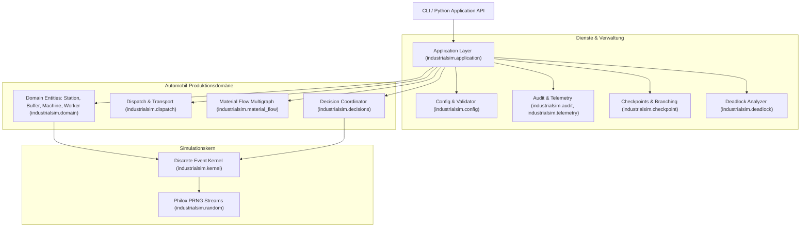

# IndustrialSim

**IndustrialSim** ist eine deterministische, reproduzierbare diskrete Ereignissimulationsumgebung für die Automobilproduktion auf Basis von CPython 3.14. Sie wurde speziell für den wissenschaftlichen und operativen Vergleich von Produktionssteuerungsheuristiken und externen Entscheidungsagenten (KI/RL/LLMs) unter exakt identischen stochastischen Bedingungen entwickelt.

Ein Plant gliedert sich organisatorisch in Areas und Halls, während der tatsächliche Materialfluss unabhängig davon als gerichteter Multigraph mit typisierten Ports modelliert wird. Production Units durchlaufen Rohbau, Lackiererei und Endmontage und begegnen begrenzten Buffers, Maschinenzuständen, Workern, Transporten, Qualitätsprüfungen, Nacharbeit und Ausfällen.

---

## Kernmerkmale & Invarianten

- ⏱️ **Deterministischer Event-Kernel**: Ganzzahlige Nanosekunden-Zeitauflösung (`time_ns`), strikte Prioritätsordnung von Ereignissen und monotone Sequenznummern garantieren bitgenaue Reproduzierbarkeit ([ADR-0001](file:///workspaces/IndustrialSim/docs/adr/0001-separate-simulation-kernel-from-production-domain.md), [ADR-0011](file:///workspaces/IndustrialSim/docs/adr/0011-build-a-small-explicit-state-event-kernel.md)).
- 🎲 **Semantisch adressierte Philox-Zufallsströme**: Unabhängige Zufallsströme je Entität verhindern Kreuzkontaminationen zwischen verschiedenen Simulationsläufen und Branches ([ADR-0002](file:///workspaces/IndustrialSim/docs/adr/0002-make-reproducibility-a-core-invariant.md)).
- 🏭 **Orthogonale Strukturmodelle**: Vollständige Entkopplung der Standort-Organisation (`Plant` → `Area` → `Hall`) vom `Material Flow Graph` ([ADR-0014](file:///workspaces/IndustrialSim/docs/adr/0014-model-material-flow-as-a-directed-multigraph.md)).
- ⏸️ **Konsistente Entscheidungspunkte (*Consistent Pause Points*)**: Die Simulationszeit pausiert vollständig, während externe Decision Provider versionierte `DecisionBatch`-Anfragen beantworten ([ADR-0003](file:///workspaces/IndustrialSim/docs/adr/0003-pause-at-consistent-decision-points.md), [ADR-0006](file:///workspaces/IndustrialSim/docs/adr/0006-use-versioned-bounded-decision-contracts.md)).
- 🔀 **Counterfactual Branching**: Von einem Checkpoint können mehrere alternative Aktionsfolgen unter kontrolliertem Zufall parallel auf mehreren CPU-Kernen ausgeführt und verglichen werden ([ADR-0009](file:///workspaces/IndustrialSim/docs/adr/0009-use-versioned-portable-checkpoints.md)).
- 🔍 **Latente Qualität vs. Qualitätsbefunde**: Strikte Trennung von verborgenen physikalischen Defekten (`QualityState`) und beobachtbaren Prüfergebnissen (`QualityFinding`) mit realistischer Sensitivität und Falsch-Positiv-Rate ([ADR-0008](file:///workspaces/IndustrialSim/docs/adr/0008-separate-latent-quality-from-findings.md)).
- 📊 **Verlustfreies Auditlog & Parquet-Telemetrie**: Entscheidungsrelevante Ereignisse werden in `audit.jsonl` erfasst, hochfrequente Telemetriedaten separat in Apache Parquet gespeichert ([ADR-0005](file:///workspaces/IndustrialSim/docs/adr/0005-separate-metrics-from-reward-policy.md), [ADR-0010](file:///workspaces/IndustrialSim/docs/adr/0010-separate-critical-logs-from-sampled-telemetry.md)).
- 🛑 **Deadlock-Diagnose**: Automatische Erkennung und Analyse zirkulärer Blockaden zwischen Stationen, Puffern und Ressourcen.
- 🔌 **Erweiterbarkeit via Plugins**: Austauschbare Stationsmodelle und Teilgraphen (z. B. `MicroSubgraphPlugin`) über Python Entry Points ([ADR-0004](file:///workspaces/IndustrialSim/docs/adr/0004-compose-macro-and-micro-production-models.md), [ADR-0012](file:///workspaces/IndustrialSim/docs/adr/0012-use-strict-declarative-configuration-and-trusted-plugins.md)).

---

## Systemvoraussetzungen & Installation

IndustrialSim setzt zwingend **CPython 3.14** voraus (Minor-Version-Constraint).

### Installation mit `uv` (empfohlen)

```bash
# Repository klonen
git clone https://github.com/eberlful/IndustrialSim.git
cd IndustrialSim

# Virtuelle Umgebung mit CPython 3.14 erstellen und Abhängigkeiten installieren
uv sync
```

---

## Schnellstart

### 1. Konfiguration validieren
Überprüfen Sie ein Simulationsmodell vor der Ausführung:
```bash
uv run industrialsim validate examples/reference_automotive_plant.yaml
```
*Ausgabe*:
```json
{
  "valid": true,
  "errors": [],
  "schema_version": "1.0"
}
```

### 2. Eine Simulationsepisode ausführen
Führen Sie die Episode aus und speichern Sie die Ergebnisartefakte:
```bash
uv run industrialsim run examples/reference_automotive_plant.yaml --output-dir ./runs/my_first_run
```

### 3. Lauf-Artefakte inspizieren
```bash
uv run industrialsim inspect ./runs/my_first_run
```

Im Zielverzeichnis `./runs/my_first_run` finden Sie:
- `manifest.json`: Vollständiges Run-Manifest (Git-Hash, Konfigurations-Hash, Seed, Kalibrierungsstatus).
- `audit.jsonl`: Lückenloses JSONL-Auditprotokoll aller Ereignisse und Entscheidungen.
- `telemetry.parquet`: Zeitreihen-Telemetriedaten für Auswertungen mit Pandas/Polars.
- `checkpoint.json.gz`: Vollständiger, serialisierter Zustand zum Simulationsende.

---

## Architekturüberblick



Weitere Details finden Sie im [Architekturhandbuch](file:///workspaces/IndustrialSim/docs/architecture.md).

---

## CLI-Befehlsübersicht

| Befehl | Beschreibung |
| :--- | :--- |
| `industrialsim validate <config>` | Validiert eine YAML-Datei gegen das strikte Pydantic-Schema. |
| `industrialsim run <config> [--output-dir <dir>]` | Simuliert eine Episode und schreibt Artefakte. |
| `industrialsim inspect <path>` | Analysiert ein Ergebnisverzeichnis oder eine Checkpoint-Datei. |
| `industrialsim resume <checkpoint> [--config <config>]` | Setzt eine pausierte Simulation bitgenau aus einem Checkpoint fort. |
| `industrialsim branch <checkpoint> <actions...> [--workers N]` | Führt parallele Counterfactual Branches alternativer Aktionen aus. |
| `industrialsim benchmark [--target {all,scheduler,plant}]` | Führt Performance- und Determinismus-Benchmarks aus. |

Detaillierte Beschreibungen aller Flags und Parameter enthält die [CLI-Referenz](file:///workspaces/IndustrialSim/docs/cli-reference.md).

---

## Python API Beispiel

IndustrialSim kann direkt aus Python heraus gesteuert werden:

```python
from industrialsim.application import run_episode, validate_config, inspect

# 1. Konfiguration prüfen
validation = validate_config("examples/minimal_episode.yaml")
if not validation.is_valid:
    raise ValueError(f"Ungültige Konfiguration: {validation.errors}")

# 2. Episode ausführen
result = run_episode(
    config_source="examples/minimal_episode.yaml",
    output_dir="./runs/api_run",
)
print(f"Status: {result.status}, Verarbeitete Events: {result.events_processed}")

# 3. Ergebnisverzeichnis untersuchen
info = inspect("./runs/api_run")
print(f"Simulierte Zeit: {info.final_sim_time_s} Sekunden")
```

---

## Qualitätssicherung, Tests & Benchmarks

Das Projekt verfügt über eine umfassende Testsuite mit 241 Tests (Unit-, Integrations-, E2E- und hypothesenbasierte Eigenschaftstests):

```bash
# Tests ausführen
uv run pytest

# Statische Typprüfung
uv run mypy src

# Performance-Benchmark ausführen (5 Mio. Scheduler-Events & Referenzwerk)
uv run industrialsim benchmark --target all
```

---

## Weiterführende Dokumentation

- 📘 **[Architekturhandbuch](file:///workspaces/IndustrialSim/docs/architecture.md)**: Detaillierte Schichtenarchitektur, EventKernel, Prioritäten, RNG-Streams und Domänenlogik.
- ⚙️ **[Konfigurationshandbuch](file:///workspaces/IndustrialSim/docs/configuration.md)**: Vollständige YAML-Spezifikation für Plants, Material Flow, Maschinen, Worker, Puffer und Trigger.
- 🤖 **[Decision Provider & Agenten-Integration](file:///workspaces/IndustrialSim/docs/decision-providers.md)**: Schnittstellen für KI-Agenten, Decision Batches, Aktionen, Fallbacks und Counterfactual Branching.
- 💻 **[CLI-Referenz](file:///workspaces/IndustrialSim/docs/cli-reference.md)**: Detaillierte Befehls-, Parameter- und Artefaktreferenz.
- 📖 **[Domänenglossar (`CONTEXT.md`)](file:///workspaces/IndustrialSim/CONTEXT.md)**: Verbindliche Begriffsdefinitionen der Domäne.
- 📈 **[Evaluierung von TimesFM 3 & Zeitreihen-Modellen](file:///workspaces/IndustrialSim/docs/timesfm-evaluation-guide.md)**: Leitfaden zum Testen multivariater Zeitreihen-Foundation-Modelle mit Telemetrie und Counterfactual Branching.
- 🔬 **[Experimente & Modellergebnisse (`experiments/`)](file:///workspaces/IndustrialSim/experiments/README.md)**: Strukturierte Berichte durchgeführter Benchmarks und Vorlage für neue Experimente.
- 🏛️ **[Architekturentscheidungen (`docs/adr/`)](file:///workspaces/IndustrialSim/docs/adr/)**: Die 15 verbindlichen Architecture Decision Records des Projekts.