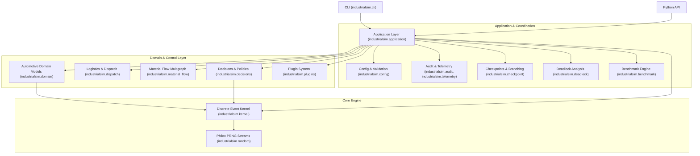

# Architekturhandbuch: IndustrialSim

Dieses Dokument beschreibt die interne Systemarchitektur, Entwurfsentscheidungen und Datenflüsse von **IndustrialSim**.

---

## 1. Übersicht & Leitprinzipien

IndustrialSim ist eine deterministische, reproduzierbare diskrete Ereignissimulationsumgebung für die Automobilproduktion auf Basis von CPython 3.14. Sie dient dem exakten, wissenschaftlichen Vergleich von Produktionssteuerungsheuristiken und externen Decision Providern (wie Reinforcement Learning oder LLM-basierten Steuerungen).

### Kernanforderungen & architektonische Invarianten

1. **Bitgenaue Reproduzierbarkeit**: Jeder Lauf muss bei gegebener Konfiguration, Startzustand, Seed und Aktionen deterministisch und plattformunabhängig dasselbe Ergebnis liefern (vgl. [ADR-0002](file:///workspaces/IndustrialSim/docs/adr/0002-make-reproducibility-a-core-invariant.md)).
2. **Strikte Schichtentrennung**: Der Simulationskern (`EventKernel`) ist vollständig entkoppelt von der Domänenlogik (`domain`, `material_flow`). Der Kern kennt keine Fertigungsbegriffe, sondern ausschließlich ganzzahlige Zeit, Ereignisordnung, Zustand und Zufallsströme (vgl. [ADR-0001](file:///workspaces/IndustrialSim/docs/adr/0001-separate-simulation-kernel-from-production-domain.md)).
3. **Orthogonale Standort- und Materialflussmodelle**: Die organisatorische Hierarchie (`Plant` → `Area` → `Hall`) ist strikt unabhängig vom `Material Flow Graph` (gerichteter Multigraph mit typisierten Ports, Zyklen und parallelen Pfaden) modelliert (vgl. [ADR-0014](file:///workspaces/IndustrialSim/docs/adr/0014-model-material-flow-as-a-directed-multigraph.md)).
4. **Konsistente Entscheidungspunkte (*Consistent Pause Points*)**: Externe Decision Provider erhalten an definierten Zustandsschwellen versionierte `DecisionBatch`-Anfragen. Während der Provider rechnet, pausiert die Simulationszeit vollständig (vgl. [ADR-0003](file:///workspaces/IndustrialSim/docs/adr/0003-pause-at-consistent-decision-points.md), [ADR-0006](file:///workspaces/IndustrialSim/docs/adr/0006-use-versioned-bounded-decision-contracts.md)).
5. **Portable Checkpoints & Counterfactual Branches**: Der Zustand ist vollständig serialisierbar (keine Python-Generatoren oder Closures). Von einem Checkpoint können mehrere isolierte Counterfactual Branches mit kontrolliertem Zufall erzeugt und verglichen werden (vgl. [ADR-0009](file:///workspaces/IndustrialSim/docs/adr/0009-use-versioned-portable-checkpoints.md)).
6. **Entkoppelte Telemetrie und Auditierung**: Kritische Entscheidungs- und Lebenszyklusdaten werden verlustfrei in einem JSONL-Auditlog erfasst. Sample-Telemetrie wird separat in Parquet-Dateien geschrieben, ohne den Kern zu blockieren (vgl. [ADR-0005](file:///workspaces/IndustrialSim/docs/adr/0005-separate-metrics-from-reward-policy.md), [ADR-0010](file:///workspaces/IndustrialSim/docs/adr/0010-separate-critical-logs-from-sampled-telemetry.md)).

---

## 2. Systemarchitektur & Komponenten

Die Architektur ist in modular aufeinander aufbauende Schichten unterteilt:



---

## 3. Der Simulationskern (`industrialsim.kernel`)

Der `EventKernel` ist ein minimalistischer, hocheffizienter diskreter Ereignissimulator (vgl. [ADR-0011](file:///workspaces/IndustrialSim/docs/adr/0011-build-a-small-explicit-state-event-kernel.md)).

### 3.1 Zeitmodell
- Die Simulationszeit wird intern ausschließlich als **ganzzahlige Nanosekunden** (`time_ns: int`) geführt.
- Konfigurierte Zeitangaben (z. B. `"10s"`, `"2h"`, `"5d"`) werden beim Laden deterministisch normalisiert.
- Gleitkommazahlen sind für Zeitpunkte und Dauern strikt unzulässig, um Rundungsfehler und Plattformdrifts auszuschließen.

### 3.2 Prioritätsklassen & deterministische Ordnung
Treffen mehrere Ereignisse zur selben Nanosekunde ein, löst der Kernel Gleichstände deterministisch über eine zweistufige Ordnung auf:
1. **Ereignispriorität** (`EventPriority`):
   - `SAFETY = 10`: Notabschaltungen und harte Randbedingungsverletzungen
   - `FAILURE = 20`: Maschinenausfälle und Ressourcenunterbrechungen
   - `COMPLETION = 30`: Abschluss von Bearbeitungsvorgängen (`Operation`) und Transporten
   - `RESOURCE = 40`: Freigabe und atomare Zuweisung von Maschinen und Workern
   - `NEW_WORK = 50`: Einlastung neuer Production Units, Transportaufträge
   - `TELEMETRY = 60`: Periodische Telemetrie- und Zustands-Snapshots
2. **Monotone Sequenznummer**: Jedes geplante Event erhält eine monoton steigende Ganzzahl (`sequence: int`), wodurch die Einfügereihenfolge bei gleicher Zeit und Priorität gewahrt bleibt.

### 3.3 Datenbasierte Ereignisse & serialisierbarer Zustand
Ein Ereignis (`ScheduledEvent`) ist ein leichtgewichtiges Datenobjekt:
```python
@dataclass(frozen=True)
class ScheduledEvent:
    time_ns: int
    priority: int
    sequence: int
    event_type: str
    payload_version: int = 1
    payload: dict[str, Any] = field(default_factory=dict)
```
Ereignishandler verändern den expliziten Zustand und planen neue Ereignisse ein. Der persistierte Zustand enthält niemals Generatoren, Closures oder Callables.

---

## 4. Pseudozufallsgenerierung (`industrialsim.random`)

IndustrialSim nutzt das **Philox-4x32**-PRNG-Verfahren (gemäß Counter-Based Pseudo-Random Number Generators):
- **Semantische Adressierung**: Zufallsströme werden über strukturierte Schlüssel adressiert, die Entitäts-ID, Ausfallmodus und Ziehungszähler umfassen.
- **Isolierte Counterfactual Branches**: Wenn in einem Branch zusätzliche Zufallsentscheidungen getroffen werden (z. B. durch alternative Aktionen eines Decision Providers), bleibt der Zufallsstrom aller anderen Entitäten und Branches davon unbeeinflusst.
- **Hierarchische Seed-Ableitung**: Aus dem Root-Seed der Konfiguration werden deterministisch Seeds für Episoden, Branches und Entitäten abgeleitet.

---

## 5. Das Domänenmodell (`industrialsim.domain`)

Die Domänenschicht bildet die Fertigungswelt unter strikter Beachtung des [Domänenglossars](file:///workspaces/IndustrialSim/CONTEXT.md) ab.

### 5.1 Organisations- und Raumstruktur
- **Plant**: Die oberste Instanz des modellierten Werks.
- **Area**: Organisatorischer Teilbereich des Plants (z. B. Rohbau, Lackiererei, Endmontage).
- **Hall**: Physische Halle innerhalb einer Area, die den Standort für Stationen und Puffer bereitstellt.

### 5.2 Produktion & Ressourcen
- **Production Unit**: Das gefertigte Fahrzeug bzw. die Karosserie mit stabiler ID, Variante, latentem `QualityState` und lückenloser Historie. Eine Production Unit befindet sich zu jedem Zeitpunkt an genau einem Knoten, in einem Transport oder in einem Terminalzustand.
- **Station**: Ein Materialflussknoten, der deklarierte Operationen ausführt. Stationen sind schlanke Abstraktionen, deren Verhalten durch komponierte Policies (Zykluszeit, Ressourcenbedarf, Qualität, Degradation) gesteuert wird (vgl. [ADR-0013](file:///workspaces/IndustrialSim/docs/adr/0013-use-thin-station-abstractions-and-composed-policies.md)).
- **Buffer**: Kapazitätsbeschränkter Knoten zur Zwischenlagerung. Standardverhalten ist *blocking-after-service*: Eine Station wird blockiert, wenn der nachgelagerte Puffer voll ist.
- **Operation**: Atomare Fertigungstransformation. Ressourcen (`Machine`, `Worker`) werden atomar reserviert, um Teilreservierungs-Deadlocks zu verhindern (vgl. [ADR-0007](file:///workspaces/IndustrialSim/docs/adr/0007-make-production-resource-semantics-explicit.md)). Unterbrechungen führen je nach Deklaration zu `resume`, `restart` oder `scrap`.
- **Machine**: Physische Ressource mit einem `Health State` (0.0 bis 1.0) und Betriebsmodi. Health State beeinflusst Zykluszeit, Defektwahrscheinlichkeit und Ausfallhazard. Wartung und Reparatur stellen die Gesundheit nur bis zu konfigurierten Obergrenzen wieder her.
- **Worker**: Qualifizierte Ressource mit Schichtplänen, Schichtwechselregeln und definierten Pausenzeiten.
- **Quality State vs. Quality Finding**: Latente Defekte (`QualityState`) existieren real im Teil, sind aber für Decision Provider unsichtbar. Nur Prüfstationen mit unvollkommener Sensitivität und Spezifität erzeugen beobachtbare `Quality Findings` (vgl. [ADR-0008](file:///workspaces/IndustrialSim/docs/adr/0008-separate-latent-quality-from-findings.md)).

---

## 6. Materialflussgraph (`industrialsim.material_flow`)

Der Materialfluss wird als **gerichteter Multigraph** modelliert:
- **Knotentypen**: `source` (Einlastung), `station` (Bearbeitung), `buffer` (Zwischenspeicher), `sink` (Ausschleusung/Fertigstellung).
- **Typisierte Ports**: Übergaben erfolgen über typisierte Ein- und Ausgangsports (`port_type`), wodurch inkompatible Übergaben bereits vor dem Simulationslauf erkannt werden.
- **Zyklen & Parallele Pfade**: Der Graph unterstützt Verzweigungen, Nacharbeitszyklen und parallele Linien.
- **Erreichbarkeit & Validierung**: Die Graphstruktur wird beim Laden statisch auf Erreichbarkeit, Port-Kompatibilität und Senken-Konnektivität geprüft.

---

## 7. Logistik & Transport (`industrialsim.dispatch`)

- **Transport Order**: Expliziter Auftrag zur Bewegung von Production Units zwischen Knoten.
- **Fahrzeugpools & Routen**: Transporte beanspruchen Fahrzeuge und unterliegen Routenkapazitäten und Transitzeiten.
- **Dispatch Policy**: Austauschbare Heuristik oder Schnittstelle zur Zuordnung von Transportaufträgen zu Fahrzeugen (z. B. `BaselineDispatchPolicy`: nächste geeignete Ressource, FIFO mit Due-Date-Tie-Breaker).

---

## 8. Entscheidungssystem & Decision Provider (`industrialsim.decisions`)

IndustrialSim ist speziell für den Vergleich von Steuerungsstrategien ausgelegt:
- **Konsistente Pausepunkte**: Erreicht das System einen getriggerten Zustand (z. B. Maschinenausfall, Pufferschwellwert, Dispatch-Bedarf, periodischer Safe-Point), friert die Simulation ein.
- **Decision Batch**: Alle an diesem Zeitpunkt offenen `DecisionRequest`s werden gebündelt. Der Decision Provider erhält eine begrenzte Beobachtung (`Bounded Observation`) und reicht eine Liste von Aktionen ein.
- **Atomare Validierung**: Aktionen werden gemeinsam gegen harte physikalische Randbedingungen validiert. Ungültige Aktionen oder Timeouts aktivieren sofort die konfigurierte deterministische `Fallback Policy`.
- **Hysterese & Re-Arming**: Trigger verhindern kaskadierende Endlosschleifen an Zustandsschwellen durch explizite Entprellungsregeln.

---

## 9. Checkpoints & Counterfactual Branching (`industrialsim.checkpoint`)

- **Versionierte Checkpoints**: Ein Checkpoint speichert den vollständigen Simulationszustand (Kernel-Queue, Event-Sequenzzähler, Zustände aller Stationen, Puffer, Maschinen, Worker, Einheiten und RNG-Streams) in einem portablen JSON/GZIP-Format.
- **Counterfactual Branching**: Ausgehend von einem Checkpoint an einem Entscheidungspunkt können alternative Aktionssets in getrennten Branches ausgeführt werden. Dank des deterministischen Philox-Zufallskonzepts untersuchen alle Branches exakt dieselbe stochastische Welt, sodass Ergebnisunterschiede ausschließlich auf die gewählten Aktionen zurückzuführen sind.
- **Parallelisierung**: Counterfactual Branches können über die Application-Schicht und CLI parallel über mehrere CPU-Kerne (`ProcessPoolExecutor`) berechnet werden.

---

## 10. Audit, Telemetrie & Deadlocks

- **AuditLogger (`audit.jsonl`)**: Lückenlose, geordnete Aufzeichnung aller Lebenszyklus-Ereignisse, Decision Requests, Aktionen und Rewards.
- **TelemetryManager (`telemetry.parquet`)**: Effiziente Speicherung hochfrequenter Metriken und Zustands-Snapshots im Apache Parquet-Format.
- **Deadlock-Diagnose (`industrialsim.deadlock`)**: Erkennt zirkuläre Wartebeziehungen zwischen Production Units, Buffers und Stations, extrahiert den Wait-for-Graphen und liefert strukturierte Ursachenberichte.
- **Run-Manifest (`manifest.json`)**: Hält Git-Commit, Runtime-Versionen, Seed, Modellparameter und Kalibrierungsflags fest.

---

## 11. Erweiterbarkeit durch Plugins (`industrialsim.plugins`)

Über standardisierte Python Entry Points (`[project.entry-points."industrialsim.plugins"]`) können neue Stationstypen oder detaillierte Subgraphen (z. B. `MicroSubgraphPlugin`) registriert werden, ohne den Simulationskern zu modifizieren (vgl. [ADR-0004](file:///workspaces/IndustrialSim/docs/adr/0004-compose-macro-and-micro-production-models.md), [ADR-0012](file:///workspaces/IndustrialSim/docs/adr/0012-use-strict-declarative-configuration-and-trusted-plugins.md)).
