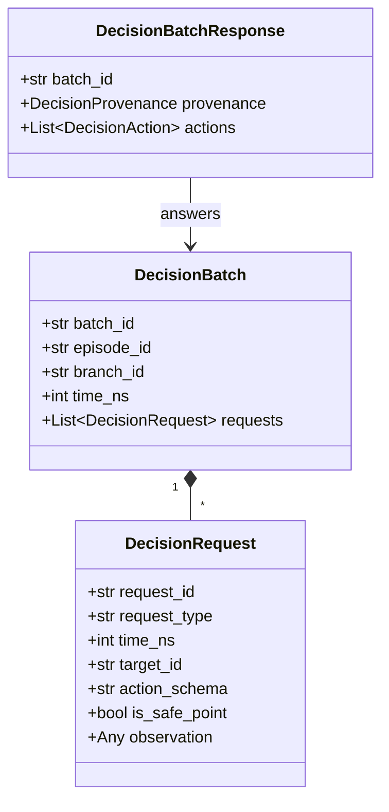
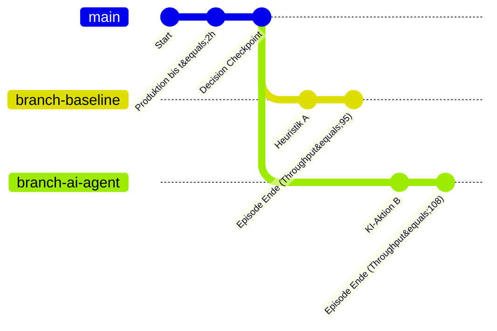

# Integrationshandbuch: Decision Provider & Counterfactual Branching

Dieses Dokument beschreibt die Schnittstellen und Mechanismen zur Anbindung externer **Decision Provider** (heuristische Steuerungen, Reinforcement-Learning-Agenten oder LLM-basierte Planer) an **IndustrialSim**.

---

## 1. Das Paradigma der konsistenten Pausepunkte (*Consistent Pause Points*)

In realen Fertigungssystemen oder einfachen Simulationen treffen externe Steuerungen Entscheidungen häufig asynchron oder zu beliebigen Zeitpunkten, was zu Race Conditions und nicht reproduzierbaren Zuständen führt.

IndustrialSim folgt dem architektonischen Prinzip des **konsistenten Pausepunkts** (vgl. [ADR-0003](file:///workspaces/IndustrialSim/docs/adr/0003-pause-at-consistent-decision-points.md)):
- Erreicht die Simulation einen konfigurierten Schwellenwert (z. B. Puffer-Füllstand, Dispatch-Bedarf, Maschinendegradation oder periodischer Safe-Point), **pausiert die gesamte Simulation bitgenau**.
- Während der externe Decision Provider Berechnungen anstellt, **verstreicht keine Simulationszeit** (`time_ns` bleibt unverändert).
- Alle zum selben Zeitpunkt anfallenden Entscheidungsbedarfe werden in einem atomaren **`DecisionBatch`** zusammengefasst (vgl. [ADR-0006](file:///workspaces/IndustrialSim/docs/adr/0006-use-versioned-bounded-decision-contracts.md)).
- Der Decision Provider beobachtet eine einheitliche, konsistente Momentaufnahme der Anlage.

---

## 2. Struktur von `DecisionBatch` und `DecisionRequest`

Ein `DecisionBatch` bündelt ein oder mehrere `DecisionRequest`-Objekte:



### 2.1 Bounded Observations (Begrenzte Beobachtungen)
Ein wesentlicher Sicherheits- und Realismusaspekt ist, dass Decision Provider **niemals Zugriff auf den internen Gesamtzustand** oder verborgene Daten erhalten:
- **Latenter Quality State**: Der reale Qualitätszustand (`QualityState`) bleibt verborgen. Der Decision Provider sieht ausschließlich aggregierte oder explizit gemessene `Quality Findings` aus vorangegangenen Prüfoperationen (vgl. [ADR-0008](file:///workspaces/IndustrialSim/docs/adr/0008-separate-latent-quality-from-findings.md)).
- **Lokaler Kontext**: Beobachtungen enthalten nur relevante Nachbarschaftsknoten, verfügbare Routen und aggregierte Werksmetriken.

#### Beobachtungstypen:
- **`BufferObservation`**: Füllstand, Kapazität, IDs und Prioritäten der Insassen (`BufferOccupantSummary`), vor- und nachgelagerte Knoten.
- **`RoutingObservation`**: Zu routende Production Unit, Variante, aktueller Knoten, zulässige Routen (`candidate_routes`).
- **`DispatchObservation`**: Transportauftrag, Quelle, Ziel, verfügbare Fahrzeuge (`available_vehicles`) und Transitzeiten.
- **`MachineObservation`**: Health State (0.0 bis 1.0), aktueller Betriebsmodus, verfügbare Modi, Wartungsstatus.
- **`StrategicObservation`**: Globale Werksmetriken, Schichtzustände und erlaubte strategische Rekonfigurationsaktionen an Safe-Points.

---

## 3. Zulässige Aktionen (`DecisionAction`)

Alle Aktionen sind streng typisierte Pydantic-Modelle mit `extra = "forbid"`:

| Aktion | Ziel (`target_id`) | Parameter | Beschreibung |
| :--- | :--- | :--- | :--- |
| **`BufferReorderAction`** | Buffer | `new_order: list[str]` | Ändert die Reihenfolge der Einheiten im Puffer (Priorisierung). |
| **`RoutingAction`** | Production Unit | `route_id: str` | Wählt den nächsten Pfad bzw. die nächste kompatible Station. |
| **`DispatchAction`** | Transport Order | `route_id: str`, `vehicle_id: str` | Weist einen Transportauftrag einem Fahrzeug und einer Route zu. |
| **`MachineModeAction`** | Machine | `mode: str` | Schaltet die Maschine in einen anderen Modus (z. B. Normal vs. Boost). |
| **`MaintenanceAction`** | Machine | `trigger_maintenance: bool` | Leitet eine präventive Wartung ein. |
| **`WorkerReassignmentAction`** | Worker | `assigned_station_id: str` | Teilt einen Worker einer anderen Station zu (nur an Safe-Points). |
| **`QualityControlAction`** | Station | `sampling_rate`, `intensity` | Passt die Prüfschärfe an (nur an Safe-Points innerhalb freigegebener Grenzen). |
| **`ReconfigurationAction`** | Station | `configuration: dict` | Taktische Linienumrüstung (nur an Safe-Points). |

---

## 4. Validierung & Konfliktauflösung

Vor der Ausführung prüft das Engine-Modul die Antwort (`DecisionBatchResponse`)
gemeinsam gegen Vertragsregeln und aktuellen Ressourcenzustand. Dieselben Regeln
gelten für manuelle Eingaben, automatische Decision Providers, Counterfactual
Branches und Fallback-Aktionen. `validate_decision_batch_response` allein prüft
lediglich den grundlegenden Vertrag und ersetzt keine Engine-Validierung.

1. **Konfliktprüfung**: Es darf nicht mehr als eine Aktion für dasselbe Ziel (`target_id`) im selben Batch vorgeschlagen werden.
2. **Keine konkurrierenden Ressourcenansprüche**: Zwei parallele Dispatch-Aktionen dürfen nicht gleichzeitig dasselbe Fahrzeug anfordern.
3. **Puffer-Konsistenz**: Ein `BufferReorderAction` muss exakt die Einheiten enthalten, die sich zum Entscheidungszeitpunkt im Puffer befinden (keine Phantomeinheiten, keine Duplikate, keine fehlenden Einheiten).
4. **Zulässigkeit von Routen & Modi**: Gewählte Routen müssen offen und kompatibel sein; Maschinenmodi müssen existieren.
5. **Safe-Point-Einschränkung**: Strategische Aktionen (z. B. Personalumverteilung) werden an operativen Triggerpunkten abgelehnt.
6. **Aktionswahl und vollständiger Batch**: Jede Anfrage benötigt eine passende Aktion; Routing und Dispatch derselben Production Unit müssen dieselbe Route wählen.
7. **Aktueller Ressourcenzustand**: Moduswechsel, Wartung und strategische Aktionen beachten Idle-Zustände. Dispatch prüft Fahrzeugfähigkeiten, Pool, Abhol-Erreichbarkeit sowie gemeinsam reservierte Routenkapazität.

Validierung verändert den Produktionszustand nicht. Erst nach vollständiger
Annahme werden direkte Effekte angewendet und anschließend Ressourcen zugeteilt.
Ungültige manuelle Eingaben lassen den Batch angehalten und korrigierbar; sie
erzeugen keine Audit- oder Fallback-Effekte. Ungültige Provider-Antworten folgen
der konfigurierten Fallback-/Abort-Regel. Diese strengeren Prüfungen können frühere
Provider-Antworten ablehnen, deren Effekte bislang stillschweigend entfielen.

---

## 5. Fallback Policies (Deterministische Ausfallsicherung)

Schlägt die Validierung fehl, antwortet der Decision Provider nicht innerhalb eines Wall-Clock-Timeouts oder wirft er eine Exception, greift sofort eine konfigurierte **Fallback Policy** (vgl. [GLOSSARY.md](file:///workspaces/IndustrialSim/GLOSSARY.md)):
- **`BaselineFallbackPolicy`**:
  - Puffer: FIFO-Reihenfolge mit Due-Date als Tie-Breaker.
  - Routing: Nächste freie kompatible Station mit kürzester Transitzeit.
  - Dispatch: Nächstes verfügbares Fahrzeug mit passender Ladefähigkeit.
  - Wartung: Zustandsbasierte Auslösung, sobald Health unter Schwellwert fällt.
- **`FifoBufferFallbackPolicy`**: Stellt sicher, dass Puffer strikt nach Eingangszeit abgearbeitet werden.

Das Auslösen eines Fallbacks wird verlustfrei im `audit.jsonl` protokolliert, sodass fehlerhaftes Agentenverhalten transparent bleibt.

Auch ein Fallback muss den vollständigen Batch und alle Ressourcenprüfungen
bestehen. Scheitert er, werden seine Aktionen nicht angewendet: Die Episode
bricht mit `INVALID_FALLBACK_BATCH` ab und protokolliert einen Failure-Eintrag
sowie die Validierungsdiagnosen. Es gibt keine rekursive Fallback-Schleife.
Die Baseline-Fallback-Auswahl wurde nicht um einen neuen Planer erweitert;
konkurrierende oder unvollständige Baseline-Aktionen können daher zum expliziten
Abbruch führen.

Das bestehende Beispiel `hierarchical_forecasting_plant.yaml` kann strategische
Requests für gerade beschäftigte Stations erzeugen, die der Forecasting-Provider
unbeantwortet lässt. Der ebenfalls unvollständige Baseline-Fallback wird jetzt
explizit abgelehnt. Eine gültige Konfiguration mit ausschließlich Buffer-Triggern
wird separat getestet und produziert weiterhin alle 45 geplanten Production Units.

---

## 6. Eigenen Decision Provider implementieren (Python API)

Ein Provider implementiert das Protokoll `DecisionProvider`:

```python
from industrialsim.decisions import (
    DecisionProvider,
    DecisionBatch,
    DecisionBatchResponse,
    DecisionProvenance,
    BufferReorderAction,
    RoutingAction,
    DispatchAction,
)

class MyCustomAgent(DecisionProvider):
    def __init__(self, agent_id: str = "agent-v1"):
        self.agent_id = agent_id

    def decide(self, batch: DecisionBatch) -> DecisionBatchResponse:
        actions = []
        for req in batch.requests:
            if req.action_schema == "routing":
                # Kürzeste zulässige Route wählen
                obs = req.observation
                best_route = min(obs.candidate_routes, key=lambda r: r.transit_time_ns)
                actions.append(
                    RoutingAction(
                        target_id=req.target_id,
                        route_id=best_route.route_id,
                    )
                )
            elif req.action_schema == "buffer_reorder":
                # Nach Liefertermin (Earliest Due Date) sortieren
                obs = req.observation
                sorted_units = sorted(
                    obs.occupants,
                    key=lambda u: u.due_date_ns if u.due_date_ns is not None else float("inf")
                )
                actions.append(
                    BufferReorderAction(
                        target_id=req.target_id,
                        new_order=[u.unit_id for u in sorted_units],
                    )
                )

        return DecisionBatchResponse(
            batch_id=batch.batch_id,
            provenance=DecisionProvenance(
                episode_id=batch.episode_id,
                batch_id=batch.batch_id,
                provider_id=self.agent_id,
            ),
            actions=actions,
        )
```

---

## 7. Counterfactual Branching

Counterfactual Branching erlaubt es, alternative Entscheidungen exakt vom selben Simulationszustand ausgehend zu vergleichen (vgl. [ADR-0002](file:///workspaces/IndustrialSim/docs/adr/0002-make-reproducibility-a-core-invariant.md), [ADR-0009](file:///workspaces/IndustrialSim/docs/adr/0009-use-versioned-portable-checkpoints.md)).



### 7.1 Kontrollierter Zufall
Durch die semantische Adressierung der Philox-Zufallsströme (`industrialsim.random`) zieht ein Ausfall oder eine Qualitätsabweichung in `branch-baseline` exakt denselben Zufallswert wie in `branch-ai-agent`. Unterschiedliche Ergebnisse sind somit **rein kausal** auf die abweichende Steuerungsentscheidung zurückzuführen.

### 7.2 CLI-Ausführung
```bash
# 2 bis 8 alternative Aktionsdateien vergleichen:
industrialsim branch checkpoint_batch_42.json.gz \
    actions_baseline.json \
    actions_agent_rl.json \
    --workers 2 \
    --output-dir ./results/counterfactual_comparison
```
Das Ergebnisverzeichnis enthält separate Auditlogs, Telemetriedaten und eine vergleichende Zusammenfassung aller Branches.
