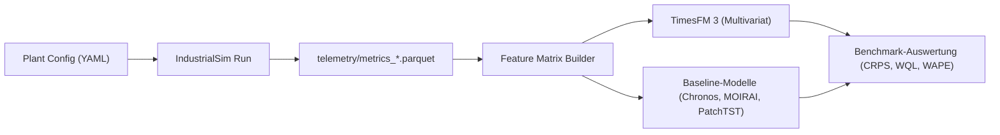
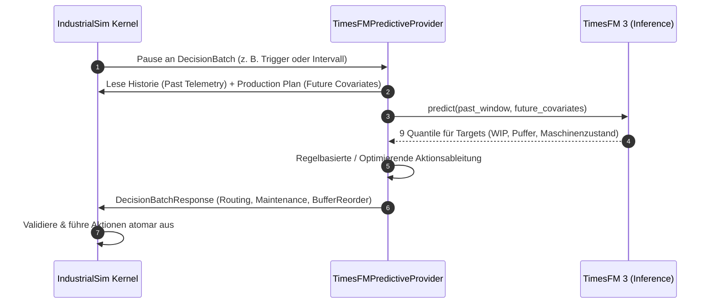
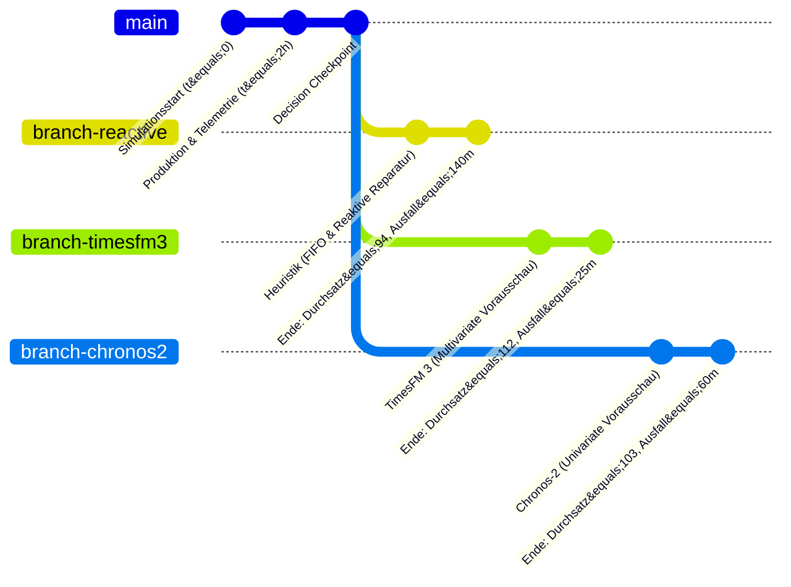

# Evaluierung von TimesFM 3 und Zeitreihen-Foundation-Modellen mit IndustrialSim

Dieses Dokument beschreibt die methodische und praktische Evaluierung von **[TimesFM 3](https://research.google/blog/timesfm-3-a-zero-shot-foundation-model-for-multivariate-forecasting/)** (Googles Zero-Shot Foundation Model für multivariates Forecasting) sowie vergleichbaren Modellen (z. B. Chronos-2, MOIRAI, Toto 2.0) mithilfe der diskreten Simulationsumgebung **IndustrialSim**.

---

## 1. Überblick & Motivation

Zeitreihen-Foundation-Modelle versprechen die Zero-Shot-Vorhersage komplexer dynamischer Systeme ohne aufwendiges domänenspezifisches Nachtrainieren. In der industriellen Fertigung stehen Prognosemodelle jedoch vor besonderen Herausforderungen:
- **Multivariate Abhängigkeiten**: Pufferfüllstände, Maschinenausfälle, Transportzeiten und Durchsatz beeinflussen sich wechselseitig nichtlinear.
- **Bekannte Zukunftsinformationen (*Past-Future Covariates*)**: Produktionspläne, geplante Schichtwechsel und Instandhaltungsfenster sind vorab deterministisch bekannt und müssen zwingend in Prognosen einfließen.
- **Kausale Entscheidungswirkung**: Ein statistisch niedriger Fehler (z. B. MSE) garantiert noch keine besseren Steuerungsentscheidungen im Werk.

**[IndustrialSim](file:///workspaces/IndustrialSim/README.md)** bietet die ideale Testumgebung:
1. **Deterministischer Event-Kernel & semantisches Philox-PRNG** ([ADR-0001](file:///workspaces/IndustrialSim/docs/adr/0001-separate-simulation-kernel-from-production-domain.md), [ADR-0002](file:///workspaces/IndustrialSim/docs/adr/0002-make-reproducibility-a-core-invariant.md)): Absolut reproduzierbare Ground-Truth-Daten ohne Seed-Verzerrungen.
2. **Parquet-Telemetrie & Auditlog** ([ADR-0005](file:///workspaces/IndustrialSim/docs/adr/0005-separate-metrics-from-reward-policy.md), [ADR-0010](file:///workspaces/IndustrialSim/docs/adr/0010-separate-critical-logs-from-sampled-telemetry.md)): Hochfrequente, strukturierte Zeitreihendaten.
3. **Konsistente Pausepunkte** ([ADR-0003](file:///workspaces/IndustrialSim/docs/adr/0003-pause-at-consistent-decision-points.md)): Externe Modelle können die Simulation bitgenau anhalten, Inferenz durchführen und Aktionen zurückmelden.
4. **Counterfactual Branching** ([ADR-0009](file:///workspaces/IndustrialSim/docs/adr/0009-use-versioned-portable-checkpoints.md)): Kausale Vergleiche alternativer Modelle vom selben Checkpoint unter exakt identischen stochastischen Bedingungen.

---

## 2. Architekturkompatibilität: TimesFM 3 vs. IndustrialSim

Die Architektur von TimesFM 3 weist spezifische Eigenschaften auf, die sich nahtlos auf die Daten- und Domänenstrukturen von IndustrialSim abbilden lassen:

| TimesFM 3 Eigenschaft | Funktionsweise in TimesFM 3 | Entsprechung in IndustrialSim |
| :--- | :--- | :--- |
| **Multivariate Token-Konstruktion** | Verarbeitet Target-Reihen, Past Covariates und Past-Future Covariates in 32-Schritt-Patches. | Telemetrie-Zeitreihen ([`METRICS_TELEMETRY_SCHEMA`](file:///workspaces/IndustrialSim/src/industrialsim/telemetry.py#L12-L31)) + Produktionsaufträge ([`ProductionPlanEntryConfig`](file:///workspaces/IndustrialSim/src/industrialsim/config.py#L611-L630)). |
| **Lookahead-Strategie** | Hängt bekannte Zukunftssignale an Patch-Tokens an, um bevorstehende Ereignisse einzubeziehen. | Geplante Freigaben (`release_time_ns`), geplante Wartungen und Schichtwechsel im Produktionsplan. |
| **Alternierende Attention** | Kausale temporale Attention (horizontal entlang der Zeit) + Full Variate Attention (vertikal über alle Zeitreihen). | Erfassung von Kreuzkorrelationen zwischen Pufferüberläufen, Maschinendegradation und Transportstaus. |
| **Probabilistische Prognose** | Liefert 9 Quantile (10. bis 90. Perzentil) für jedes Zeitfenster in einem Forward-Pass. | Quantifizierung des Ausfall- oder Überlaufrisikos für risikobasierte Entscheidungsregeln. |
| **Non-Autoregressives Single-Pass Decoding** | Erzeugt den gesamten Prognosehorizont ohne Schleifen via *Contiguous Patch Masking*. | Geringe Inferenz-Latenz an konsistenten Entscheidungspunkten (`DecisionBatch`). |

---

## 3. Testpfad 1: Offline Zero-Shot Benchmark (Prognosegüte)

Hierbei wird IndustrialSim als Syntheserate-Generator für Benchmark-Datensätze verwendet.



### 3.1 Feature-Mapping

Die von IndustrialSim erzeugte Parquet-Telemetrie ([`METRICS_TELEMETRY_SCHEMA`](file:///workspaces/IndustrialSim/src/industrialsim/telemetry.py#L12-L31)) wird in drei Gruppen eingeteilt:

1. **Target-Reihen ($Y_{1:T+H}$)**:
   - `wip`: Gesamtbestand an Einheiten in Arbeit.
   - Puffer-Füllstände: Belegungsgrad kritischer Puffer vor Engpassstationen.
   - `machines_failed` / `HealthState`: Maschinenverschleiß und Ausfallereignisse.
   - `lead_time_ns` / `good_output`: Durchlaufzeiten und Fertigstellungsrate.

2. **Past Covariates ($X_{1:T}$)**:
   - `scrap`: Historisch detektierte Ausschussmengen.
   - `downtime_ns`: Bisher aufgelaufene Stillstandszeiten.
   - `vehicles_busy` / `vehicles_idle`: Flottenauslastung der Logistik.

3. **Past-Future Covariates ($Z_{1:T+H}$)**:
   - Geplante Einsteuerungen aus dem [Production Plan](file:///workspaces/IndustrialSim/GLOSSARY.md#production) (Varianten, Mengen je Zeitschritt).
   - Schichtkalender der Worker (geplante Arbeitszeiten und Pausen).
   - Geplante Instandhaltungsabschaltungen (`PlannedDisruptionConfig`).

### 3.2 Vergleichsmodelle
- **Foundation Models**: TimesFM 3 (Univariat vs. Multivariat), Amazon Chronos-2, Salesforce MOIRAI, Toto 2.0.
- **Spezialisierte Deep-Learning-Baselines**: PatchTST, TiDE, DLinear.
- **Statistische Baselines**: AutoARIMA, ETS.

### 3.3 Evaluierungsmetriken
- **Punktprognose**: MAE, RMSE, WAPE (Weighted Absolute Percentage Error).
- **Probabilistische Prognose**: CRPS (Continuous Ranked Probability Score) und Weighted Quantile Loss (WQL) über die 9 Quantile $q \in \{0.1, 0.2, \dots, 0.9\}$.
- **Ablationsstudie**: Vergleich von TimesFM 3 *ohne Kovariaten* (rein univariat) vs. *mit Past-Future Covariates* (multivariat), um den Mehrwert des Produktionsplans zu isolieren.

---

## 4. Testpfad 2: Online Closed-Loop (Predictive Decision Provider)

In diesem Setup wird das Modell direkt an das Entscheidungsprotokoll von IndustrialSim angebunden.



### 4.1 Implementierungsbeispiel eines Decision Providers

```python
from __future__ import annotations
from typing import Sequence
import numpy as np

from industrialsim.decisions import (
    DecisionProvider,
    DecisionBatch,
    DecisionBatchResponse,
    DecisionProvenance,
    DecisionAction,
    MaintenanceAction,
    RoutingAction,
    BufferReorderAction,
)

class TimesFMPredictiveProvider(DecisionProvider):
    """
    Vorausschauender Decision Provider auf Basis von TimesFM 3.
    Nimmt Prognosen über Pufferstände und Maschinenausfälle vor,
    um proaktiv zu steuern.
    """
    def __init__(self, model_client, plant_interface, agent_id: str = "timesfm3-agent"):
        self.model = model_client
        self.plant = plant_interface
        self.agent_id = agent_id

    def decide(self, batch: DecisionBatch) -> DecisionBatchResponse:
        actions: list[DecisionAction] = []

        # 1. Telemetrie-Fenster (Past) und Produktionsplan (Future Covariates) abrufen
        history_series = self.plant.get_recent_telemetry_matrix(window_steps=512)
        future_covariates = self.plant.get_future_plan_matrix(horizon_steps=64)

        # 2. Multivariates Zero-Shot Forecasting mit TimesFM 3
        # Liefert Quantilprognosen [batch, horizon, quantiles, series]
        forecast = self.model.forecast(
            past_series=history_series,
            future_covariates=future_covariates,
        )

        for req in batch.requests:
            # Anwendungsfall A: Vorausschauende Instandhaltung (Predictive Maintenance)
            if req.action_schema == "maintenance":
                # 90%-Perzentil des Ausfallrisikos für diese Maschine prüfen
                risk_q90 = forecast.get_quantile(series=f"machine_risk_{req.target_id}", q=0.9)
                if np.max(risk_q90) > 0.80:
                    actions.append(
                        MaintenanceAction(
                            target_id=req.target_id,
                            trigger_maintenance=True,
                        )
                    )

            # Anwendungsfall B: Proaktives Routing zur Engpassvermeidung
            elif req.action_schema == "routing":
                obs = req.observation
                # Pufferfüllstände entlang der alternativen Routen prognostizieren
                best_route = None
                lowest_predicted_load = float("inf")

                for route in obs.candidate_routes:
                    pred_load = forecast.get_mean(series=f"buffer_load_{route.target_station_id}")
                    if pred_load < lowest_predicted_load:
                        lowest_predicted_load = pred_load
                        best_route = route

                if best_route is not None:
                    actions.append(
                        RoutingAction(
                            target_id=req.target_id,
                            route_id=best_route.route_id,
                        )
                    )

            # Anwendungsfall C: Puffer-Neuordnung (Buffer Reordering)
            elif req.action_schema == "buffer_reorder":
                # Priorisiere Teile für die Station, deren Warteschlange droht leerzulaufen
                obs = req.observation
                sorted_units = sorted(
                    obs.occupants,
                    key=lambda u: u.due_date_ns if u.due_date_ns is not None else float("inf"),
                )
                actions.append(
                    BufferReorderAction(
                        target_id=req.target_id,
                        new_order=[u.unit_id for u in sorted_units],
                    )
                )

        return DecisionBatchResponse(
            batch_id=batch.batch_id,
            provenance=DecisionProvenance(
                episode_id=batch.episode_id,
                batch_id=batch.batch_id,
                provider_id=self.agent_id,
            ),
            actions=actions,
        )
```

---

## 5. Testpfad 3: Kausale Validierung via Counterfactual Branching

Die entscheidende Stärke von IndustrialSim liegt in der **kausalen Wirkungsmessung**: Führt eine bessere Modellprognose tatsächlich zu messbaren operativen Verbesserungen in der Fabrik?



### 5.1 Warum Counterfactual Branching unverzichtbar ist
1. **Identische Philox-Zufallsströme** ([ADR-0002](file:///workspaces/IndustrialSim/docs/adr/0002-make-reproducibility-a-core-invariant.md)): Maschinenverschleiß, Bearbeitungszeiten und Reparaturdauern ziehen in allen Branches exakt dieselben Zufallswerte.
2. **Kausale Isolierung**: Jeglicher Unterschied im Durchsatz (`good_output`) oder in der Durchlaufzeit (`lead_time_ns`) ist zu 100 % auf die Entscheidungen des jeweiligen Modells zurückzuführen.
3. **Oracle-Baseline**: Sie können einen "Oracle"-Branch simulieren, der mit perfekter Zukunfts-Kenntnis agiert, und so die theoretische Obergrenze bestimmen.

### 5.2 Durchführung über die CLI
```bash
# 1. Episode bis zum Entscheidungspunkt simulieren und Checkpoint schreiben
industrialsim run examples/reference_automotive_plant.yaml \
    --output-dir ./runs/base_phase

# 2. Drei alternative Modell-Entscheidungen parallel verzweigen
industrialsim branch ./runs/base_phase/checkpoint.json.gz \
    actions_heuristic.json \
    actions_chronos2.json \
    actions_timesfm3.json \
    --workers 3 \
    --output-dir ./runs/counterfactual_eval

# 3. Ergebnisse analysieren
industrialsim inspect ./runs/counterfactual_eval
```

---

## 6. Schritt-für-Schritt-Leitfaden für eigene Experimente

### Schritt 1: Telemetrie in der Anlagen-Konfiguration aktivieren
Stellen Sie in Ihrer YAML-Konfiguration (z. B. `my_plant.yaml`) ein äquidistantes Sampling-Intervall ein, das gut zu den 32-Schritt-Patches von TimesFM 3 passt (z. B. alle 30 oder 60 Sekunden):

```yaml
telemetry:
  enabled: true
  sample_interval: "30s"
  batch_size: 200
  backpressure:
    policy: "thin"
    max_queue_size: 1000
    thin_factor: 2
```

### Schritt 2: Episode ausführen und Parquet exportieren
```bash
uv run industrialsim run my_plant.yaml --output-dir ./runs/exp_01
```

### Schritt 3: Zeitreihendaten in Python / Polars laden
```python
import polars as pl

# Aggregierte Metriken laden
df = pl.read_parquet("runs/exp_01/telemetry/metrics_fragment_*.parquet")

# Zu 30s-Raster aufbereiten
ts = df.select([
    "simulated_time_ns",
    "good_output",
    "wip",
    "lead_time_ns",
    "machines_busy",
    "machines_failed",
    "workers_busy"
]).sort("simulated_time_ns")

print(ts.head())
```

---

## 7. Zusammenfassung

| Testziel | Empfohlene Methode | Primäre Metriken |
| :--- | :--- | :--- |
| **Statistische Prognosegüte** | Offline-Auswertung auf Parquet-Telemetrie | MAE, RMSE, WAPE, CRPS |
| **Mehrwert von Zukunfts-Kovariaten** | Ablationsvergleich: Univariat vs. Multivariat mit Production Plan | Delta WQL / Quantile Loss |
| **Operativer Nutzen & Wirtschaftlichkeit** | Online Decision Provider mit Counterfactual Branching | Durchsatz (`good_output`), Stillstand (`downtime_ns`), Termintreue (`lateness_ns`) |
| **Modellvergleich** | Branching von identischen Checkpoints (TimesFM 3 vs. Chronos-2 vs. Baseline) | Netto-Produktionsgewinn je Branch |
